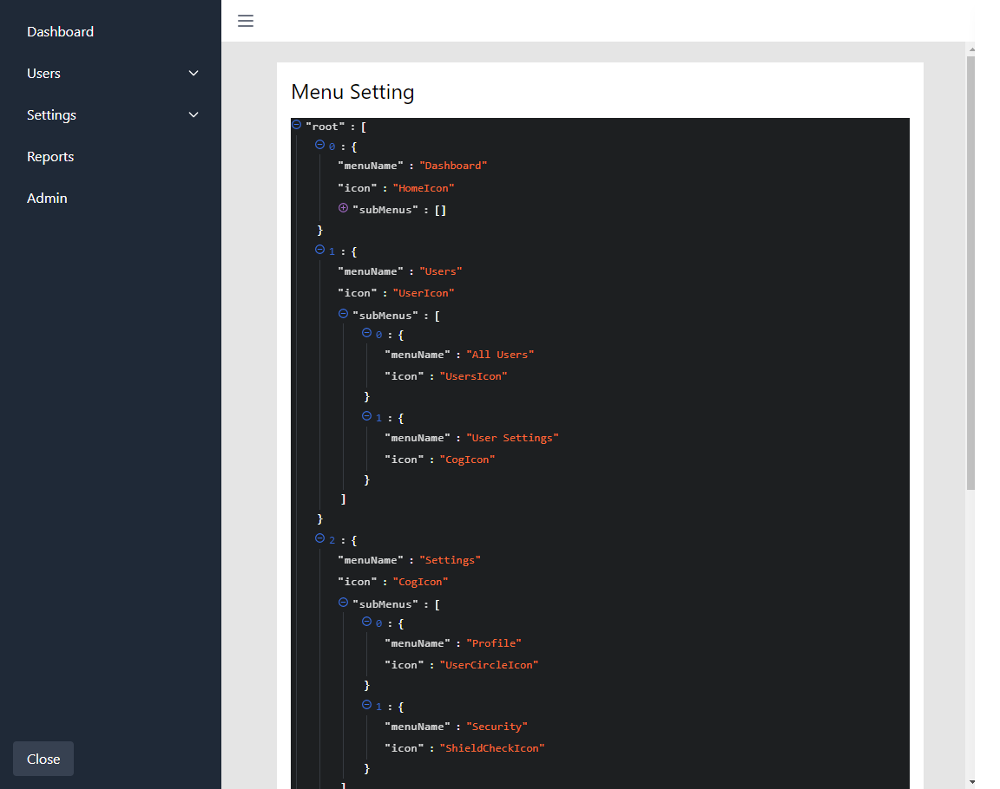

# Bloomars Dashboard

A simple dashboard with chat app which displays the answer randomly with a prompt.

It has basic sidebar and nav bars which has dynamic routes.

<!-- A comprehensive playground template for building rich-text editors with [Plate](https://platejs.org/) and Next.js 14. -->

## Requirements

Node.js ^18.17.0

## Installation

Clone the repository:

```shell
git clone git@github.com:emontalvo610/bloomars_next.js.git

```

Install the modules

```shell
npm install
```

Run the app

```shell
npm start
```

Visit the application

```shell
http://localhost:3000
```

## Features

1. Dynamic Menus

- It has dynamic menus which can be changed by JSON data
- Each menu can have icon and name and nested menus
- There is `close` button which will collapse/uncollapse the menu

2. Main Page

- In the main page, it just has header and tab items based on menu change

3. Dynamic Routing

- Based on menu or tab selection, it will dynamically navigate to the proper routes
- Also selected menu or tab should be active and the others shouldn't be active

4. Prompt View

- Hamburger menu item selection will show the prompt view
- User can input prompt and get answers(random) and display the `streaming-like` texts
- It saves the list of prompts and answers and it should be scrollable


5. Admin Page

- There is admin page which can set the menus and sample answer and this setting will be saved on backend



## Challenges

The main challenge through this application is making dynamic menus/tabs/routes from JSON data. To do so, I parsed the menu JSON data and made dynamic routes and save current settings in the backend.

Another a bit of challenge is displaying the prompt answer in streaming way using timer. I thought it was complicated but it's just updating the text in timely manner and just draw it.
